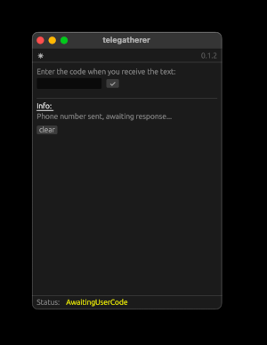

# `telechecker` (GUI)

A rust port of [BellingCat's `telegram-phone-number-checker`](https://github.com/bellingcat/telegram-phone-number-checker/tree/main). 

`telechecker` is a GUI tool used to check if the provided phone numbers are connected to Telegram, retrieving and outputting information about those users. Currently only outputs in JSON format.


## Installation

### GitHub

Currently available for Linux, macos, and Windows on the latest github release, found [here: https://github.com/orph3usLyre/telechecker/releases/latest](https://github.com/orph3usLyre/telechecker/releases/latest), under the name `telechecker_gui`. 

### Build
* Note that this requires having the rust compiler installed, see https://www.rust-lang.org/tools/install for information.


```sh
git clone https://github.com/orph3usLyre/telechecker.git
cargo build -p telechecker_gui --release

# run
./target/release/<YOUR_PLATFORM>/telechecker_gui
```


## Usage/Examples

* **NOTE:** The GUI version is currently in alpha version and is subject to change

### 0) If you don't have a `.env` file configured in the directory where the program is run, first provide API info


### 1) First provide a telegram-connected phone number


### 2) Wait for and input the code you receive


### 3) If you have a password, you'll need to input it


### 4) Input a list of phones to check in the text box


### 5) Receive results 


## Requirements

In order to use `telechecker`, you will need to provide a phone number that has an associated telegram account when prompted. 

The user also needs an `API_ID` and `API_HASH`. These can be retrieved after creating a Telegram developer's account. Follow the steps here: https://core.telegram.org/api/obtaining_api_id#obtaining-api-id. 

These values must either be placed in a file named `.env`, in the same folder as the program, or provided at program launch.

#### Example `.env`
```env
API_ID='98237402'
API_HASH='100e7ca8f666b89884031a690c4c95bd'
```

The user may also place their phone number inside the `.env` file:
```env
PHONE_NUMBER='+11234567890'
```

or provide it as a command line argument:
```
telechecker --user-phone +11234567890 ...
```

or provide it when prompted, if not supplied.


